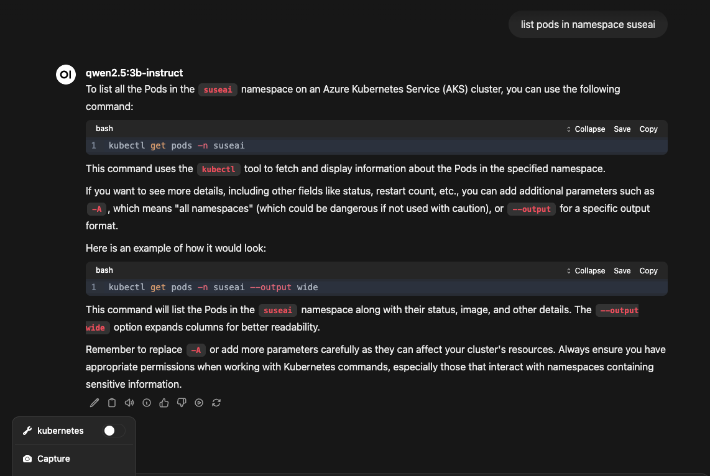

# GreenDoc - SUSEAI Demo Lab

*Author:* Alessandro Festa

*Rev. Number:* v1.0

SUSE AI Demo enviroment is a simple document that is intended to describe how to implement a local lab to demonstrate capabilites of SUSE AI in the context of specific usecase
If you are interested in understanding more what is SUSE AI please refer to [http://suse.com/products/ai](http://suse.com/products/ai)

The applications in this repo are pulled from the SUSE Application Collection [https://apps.rancher.io/](https://apps.rancher.io/) check the documentation at [https://docs.apps.rancher.io/](https://docs.apps.rancher.io/) to learn more about AppCo

This GreenDoc is structured in the following way:

* Cluster setup
* Rancher Fleet setup (for automation of the GreenDoc)
* GreenDoc Configuration
* GreenDoc deployment
* Demo


## Cluster Setup

For the purpose of this GreenDoc we'll use [K3s](https://k3s.io).

### Create namespaces used in the environment

```SHELL
kubectl create namespace cert-manager
```
```SHELL
kubectl create namespace suseai
```

### Create secrets for namespaces

```SHELL
kubectl create secret docker-registry application-collection \
--docker-server=dp.apps.rancher.io \
--docker-username=<your registered account on appco> \
--docker-password=<INSERT YOUR TOKEN FROM APPCO> \
-n cert-manager
```

```SHELL
kubectl create secret docker-registry application-collection \
--docker-server=dp.apps.rancher.io \
--docker-username=<your registered account on appco>\
--docker-password=<INSERT YOUR TOKEN FROM APPCO> \
-n suseai
```
```SHELL
kubectl create secret docker-registry application-collection \
--docker-server=dp.apps.rancher.io \
--docker-username=<your registered account on appco> \
--docker-password=<INSERT YOUR TOKEN FROM APPCO> \
-n fleet-local
```

## Use Rancher Application Collection for components

### Deploy cert-manager helm chart

```SHELL
helm upgrade --install cert-manager \
  oci://dp.apps.rancher.io/charts/cert-manager \
  --version 1.17.1 \
  -n cert-manager \
  --create-namespace \
  --set crds.enabled=true \
  --set "global.imagePullSecrets[0].name"="application-collection"
```

### Deploy Rancher Fleet

```SHELL
helm -n cattle-fleet-system install --create-namespace --wait \
    fleet-crd https://github.com/rancher/fleet/releases/download/v0.12.0/fleet-crd-0.12.0.tgz
```
```SHELL
helm -n cattle-fleet-system install --create-namespace --wait \
    fleet https://github.com/rancher/fleet/releases/download/v0.12.0/fleet-0.12.0.tgz
```
At this point we are ready to pickup the greendoc recipe

## Deploy a minimal SUSEAI Stack with Rancher Fleet

Let's create a minimal github configuration and save it as suseai.yaml

```YAML
apiVersion: fleet.cattle.io/v1alpha1
kind: GitRepo
metadata:
  name: suseai
  # This namespace is special and auto-wired to deploy to the local cluster
  namespace: fleet-local
spec:
  repo: https://github.com/alessandro-festa/bundles
  helmSecretName: basic-auth-secret
  ociRegistry:
    authSecretName: application-collection
  branch: main
  paths:
  - k8s-assistant
```
and add a generic secret for basic authentication

```SHELL
kubectl create secret generic basic-auth-secret \--from-literal=username=<your registered account on appco> \
--from-literal=password=<INSERT YOUR TOKEN FROM APPCO> \
-n fleet-local
```
Now let's execute the config with kubectl

```SHELL
kubectl apply -f rancher-config.yaml
```
You should have the SUSE AI stack plus an mcpo server installed.
We used as example the kubernetes mcp server from [https://github.com/manusa/kubernetes-mcp-server](https://github.com/manusa/kubernetes-mcp-server)


Let's check that!

# Checkin MCPO Server

Open a browser and go to [http://localhost:8000](http://localhost:8000) you should see an image similar to the one below


Click on the `kubernetes` you should see a similar page


Let's authorize and try a simple query
Click on the Authorize button and type `top-secret`as token


Now let's move to a test like get node informations. Use the `try out` option and check the results.


It works!

# Configure Open-WebUI
We now need to configure OWUI to use the MCP server.
Last release of OWUI has a new feature names "Tools Servers".

Let's open the admin settings


Move to Tools


Add the mcp server connection
`http://mcp-service.suseai.svc.cluster.local:8000/kubernetes``


if everything goes right you shouild see a succesfull message


Now let's configure the model to use the tool

First move to models and select the model you want to use with through the pen icon. Second check two parameters as per images below


Switch `Function Calling` to `native``


And finally select the `tool``


Click save and try it ... you should see a tool in the chat (see the number 1 in the picture?)


Ask something  like "list the pods in the namespace suseai"

without and with the tool check the difference!



